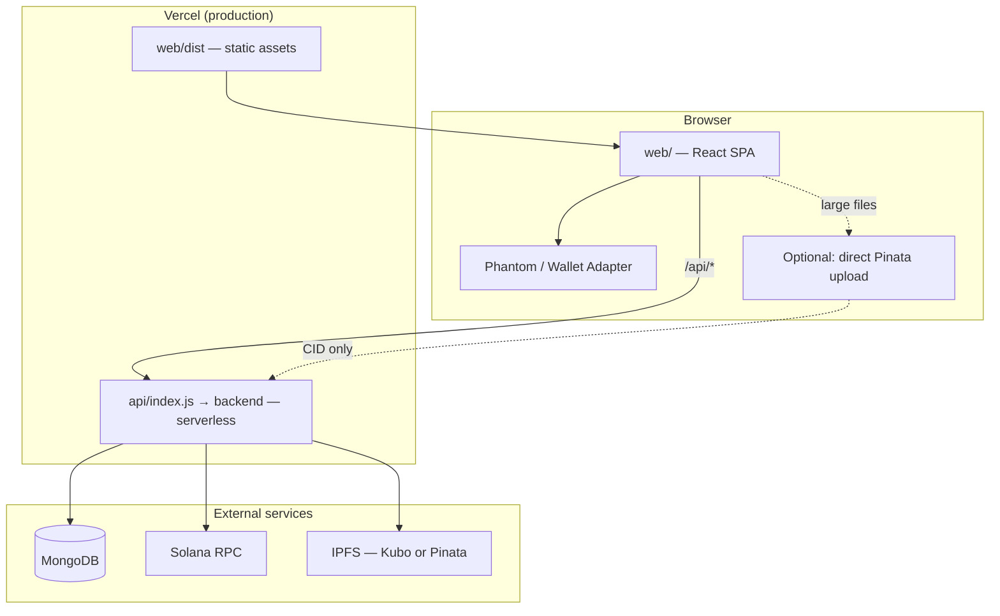
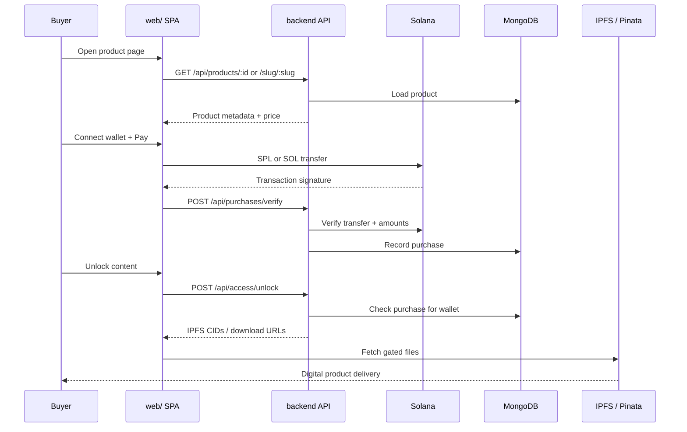
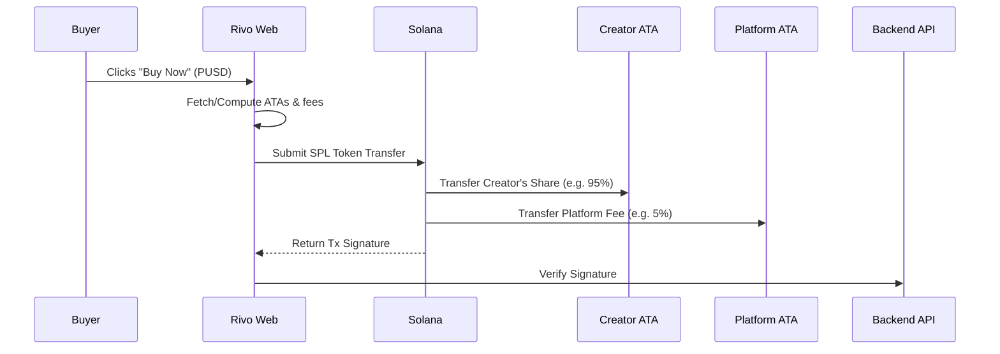
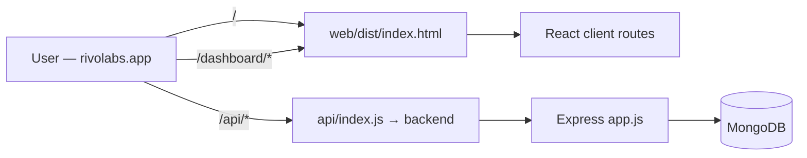

# Rivo

**Stablecoin-native creator monetization** — sell real digital products, accept crypto checkout and unlock content after on-chain payment verification.

**Production:** [rivolabs.app](https://rivolabs.app)

---

## Table of contents

- [Overview](#overview)
- [What’s in this repo](#whats-in-this-repo)
- [Architecture](#architecture)
  - [System overview](#system-overview)
  - [Purchase & unlock flow](#purchase--unlock-flow)
  - [Production deployment (Vercel)](#production-deployment-vercel)
- [Repository structure](#repository-structure)
- [Tech stack](#tech-stack)
- [Frontend routes](#frontend-routes)
- [API reference](#api-reference)
- [Local development](#local-development)
- [Environment variables](#environment-variables)
- [IPFS & file uploads](#ipfs--file-uploads)
- [Deployment](#deployment)
- [Anchor program](#anchor-program)
- [Waitlist app](#waitlist-app)
- [Security](#security)
- [Roadmap](#roadmap)

---

## Overview

Rivo lets creators:

1. Connect a Solana wallet (e.g. Phantom).
2. Create and publish digital products with a price in **PUSD**, **USDC** (legacy listings), or **SOL**.
3. Upload delivery files to **IPFS** (local Kubo or Pinata).
4. Share a public product URL (`/p/:id` or `/:slug`).
5. Receive payment when a buyer completes checkout; the backend **verifies the transaction** on-chain before unlocking access.

Buyers browse the marketplace, pay from their wallet, and unlock gated content immediately after verification.

---

## What’s in this repo

| Package                | Role                                                                                                           |
| ---------------------- | -------------------------------------------------------------------------------------------------------------- |
| **`web/`**             | React + Vite SPA — landing page, marketplace, creator dashboard, public product pages, wallet checkout         |
| **`backend/`**         | Express API — products, purchases, IPFS uploads, analytics, email subscribers                                  |
| **`programs/ripple/`** | Anchor program (`purchase`) — optional on-chain SOL transfer rail (MVP uses native transfers + backend verify) |
| **`waitlist/`**        | Standalone waitlist landing + MongoDB signup (separate deploy)                                                 |
| **`api/index.js`**     | Vercel serverless entry (re-exports `backend/api/index.js`)                                                    |
| **`vercel.json`**      | Monorepo deploy: static `web/dist` + serverless `api/index.js`                                                 |

---

## Architecture

### System overview



### Purchase & unlock flow



### How stablecoins like PUSD work in Rivo

Rivo natively supports **PUSD** (PALM USD) alongside **USDC** and **SOL** for checkout. The stablecoin integration is fully decentralized and non-custodial.

1. **Pricing setup:** Creators price their items in PUSD.
2. **Token Accounts:** When a buyer clicks "Buy now", the frontend checks if the buyer has a PUSD Associated Token Account (ATA) with enough balance.
3. **Transaction Execution:** Rivo builds an SPL token transfer instruction that moves PUSD directly from the buyer's ATA to the creator's payout ATA.
4. **Platform Fee:** A small percentage fee is routed to the platform treasury in the same transaction using a separate transfer instruction.
5. **Backend Verification:** After Solana network confirms the transaction, the buyer's client sends the tx signature to the backend. The backend validates the block, verifies the token mint address (to prevent fake PUSD), checks the transferred amount, and ensures the creator was paid before unlocking content.




### Production deployment (Vercel)



**Routing (`vercel.json`):**

| Request                    | Served by                   |
| -------------------------- | --------------------------- |
| `/api/*`                   | Serverless Express handler  |
| Static files in `web/dist` | CDN (JS, CSS, assets)       |
| Everything else            | `index.html` (SPA fallback) |

---

## Repository structure

```text
Ripple/
├── web/                    # Frontend (Vite + React + TypeScript)
│   ├── src/
│   │   ├── App.tsx         # Routes, layout, landing, product pages
│   │   ├── pages/dashboard/  # Creator dashboard pages
│   │   ├── lib/            # API client, payments, IPFS upload helpers
│   │   └── config/tokens.ts
│   └── public/assets/      # Token logos, images
├── api/
│   └── index.js            # Vercel serverless entry (re-exports backend)
├── backend/
│   ├── src/app.js          # Express routes + MongoDB models
│   ├── src/verifyTransfer.js
│   └── api/index.js        # Express handler used by api/index.js
├── programs/ripple/        # Anchor Rust program
├── waitlist/               # Separate waitlist site + API
├── vercel.json             # Deploy config
├── Anchor.toml
└── README.md
```

---

## Tech stack

| Layer               | Technologies                                                              |
| ------------------- | ------------------------------------------------------------------------- |
| Frontend            | React 19, TypeScript, Vite 7, React Router, Framer Motion, Tailwind CSS 4 |
| Wallet              | `@solana/wallet-adapter-*`, Phantom                                       |
| Backend             | Node.js, Express 5, Mongoose, Zod                                         |
| Chain               | `@solana/web3.js`, SPL token transfers                                    |
| Storage             | IPFS (Kubo local or Pinata JWT)                                           |
| Deploy              | Vercel (static + serverless), Vercel Analytics                            |
| On-chain (optional) | Anchor — `programs/ripple`                                                |

---

## Frontend routes

| Path                           | Description                          |
| ------------------------------ | ------------------------------------ |
| `/`                            | Marketing landing (hero, coins, CTA) |
| `/products`                    | Public marketplace listing           |
| `/dashboard/home`              | Creator home                         |
| `/dashboard/products`          | Manage products                      |
| `/dashboard/products/new`      | Create product                       |
| `/dashboard/products/:id/edit` | Edit product                         |
| `/dashboard/payment`           | Payout wallet settings               |
| `/dashboard/purchases`         | Purchase history                     |
| `/dashboard/discover`          | Discover feed                        |
| `/p/:id`                       | Public product by ID                 |
| `/:slug`                       | Public product by slug               |

Footer email signup posts to `POST /api/subscribers`.

> **Note:** `DashboardAnalyticsPage` exists under `web/src/pages/dashboard/` and uses `/api/analytics/*`; wire a route in `App.tsx` if you want it in the nav.

---

## API reference

All routes are prefixed with **`/api`**.

### Health & config

| Method | Route     | Purpose                                        |
| ------ | --------- | ---------------------------------------------- |
| `GET`  | `/health` | Health check (`ok`, Mongo, IPFS/Pinata status) |
| `GET`  | `/tokens` | Runtime SPL mint addresses for checkout        |

### Products

| Method   | Route                         | Purpose                             |
| -------- | ----------------------------- | ----------------------------------- |
| `GET`    | `/products`                   | List published marketplace products |
| `GET`    | `/products/creator/:wallet`   | Creator’s products                  |
| `GET`    | `/products/slug/:slug`        | Product by slug                     |
| `GET`    | `/products/:id`               | Product by ID                       |
| `GET`    | `/products/:id/owner/:wallet` | Product for owner editing           |
| `POST`   | `/products`                   | Create product                      |
| `PUT`    | `/products/:id`               | Update product                      |
| `POST`   | `/products/:id/publish`       | Publish product                     |
| `DELETE` | `/products/:id`               | Delete product                      |

### Purchases & access

| Method | Route                        | Purpose                                         |
| ------ | ---------------------------- | ----------------------------------------------- |
| `POST` | `/purchases/verify`          | Verify on-chain payment and record purchase     |
| `POST` | `/access/unlock`             | Return delivery payload after verified purchase |
| `GET`  | `/download/:productId`       | Download metadata for buyer                     |
| `GET`  | `/access/download-file`      | Stream purchased file (authenticated)           |
| `GET`  | `/purchases/wallet/:wallet`  | Buyer purchase history                          |
| `GET`  | `/purchases/creator/:wallet` | Creator sales history                           |

### Creators & files

| Method | Route                             | Purpose                                   |
| ------ | --------------------------------- | ----------------------------------------- |
| `GET`  | `/creators/:wallet/payout`        | Read payout wallet                        |
| `POST` | `/creators/:wallet/payout`        | Update payout wallet                      |
| `POST` | `/digital-products/upload`        | Upload file via API → IPFS                |
| `POST` | `/digital-products/register-ipfs` | Register CIDs after browser Pinata upload |

### Analytics & marketing

| Method | Route                  | Purpose                    |
| ------ | ---------------------- | -------------------------- |
| `POST` | `/analytics/track`     | Record page visit          |
| `GET`  | `/analytics/dashboard` | Aggregated visitor metrics |
| `POST` | `/subscribers`         | Footer email signup        |

---

## Local development

### Prerequisites

- Node.js 20+
- MongoDB (Atlas or local)
- Solana wallet on **devnet** for testing
- Optional: [Kubo IPFS](https://docs.ipfs.tech/install/) (`ipfs daemon`) for local uploads

### 1. Backend

```bash
cd backend
cp .env.example .env   # fill in values
npm install
npm run dev
```

API base: `http://localhost:4000/api`

Health check:

```bash
curl http://localhost:4000/api/health
```

Expected: `{ "ok": true, ... }`

### 2. Frontend

```bash
cd web
cp .env.example .env   # fill in values
npm install
npm run dev
```

App: `http://localhost:5173`

### 3. Build frontend (production bundle)

```bash
cd web
npm run build
# output: web/dist/
```

---

## Environment variables

### Backend — `backend/.env`

See `backend/.env.example`. Key variables:

| Variable                                             | Purpose                                    |
| ---------------------------------------------------- | ------------------------------------------ |
| `PORT`                                               | Local server port (default `4000`)         |
| `MONGODB_URI`                                        | MongoDB connection string                  |
| `SOLANA_RPC`                                         | Solana JSON-RPC URL                        |
| `CORS_ORIGINS`                                       | Allowed frontend origins (comma-separated) |
| `RIPPLE_FEE_WALLET`                                  | Platform fee recipient (legacy env name)   |
| `PUSD_MINT_ADDRESS` / `USDC_MINT_ADDRESS`              | SPL mints for checkout                     |
| `PINATA_JWT`                                         | Pinata uploads (production / Vercel)       |
| `IPFS_LOCAL_ONLY=1`                                  | Force Kubo-only; ignore Pinata locally     |
| `IPFS_API_*` / `IPFS_GATEWAY_*`                      | Local Kubo settings                        |

### Frontend — `web/.env`

See `web/.env.example`. Key variables:

| Variable                       | Purpose                                                        |
| ------------------------------ | -------------------------------------------------------------- |
| `VITE_API_URL`                 | API base (`http://localhost:4000/api` local, `/api` on Vercel) |
| `VITE_SOLANA_RPC`              | Must match backend cluster                                     |
| `VITE_SOLANA_NETWORK`          | e.g. `devnet`                                                  |
| `VITE_*_MINT_ADDRESS`          | Token mint overrides                                           |
| `VITE_PINATA_JWT`              | Browser → Pinata direct upload (large files)                   |
| `VITE_ANALYTICS_DASHBOARD_URL` | Optional external analytics link                               |

---

## IPFS & file uploads

| Mode                 | When to use                              | Config                                                     |
| -------------------- | ---------------------------------------- | ---------------------------------------------------------- |
| **Local Kubo**       | Development                              | `ipfs daemon`, `IPFS_LOCAL_ONLY=1`, gateway on `:8081`     |
| **Pinata (API)**     | Vercel / production                      | `PINATA_JWT` on backend                                    |
| **Pinata (browser)** | Large files (> ~4.5 MB serverless limit) | `VITE_PINATA_JWT` + `POST /digital-products/register-ipfs` |

Flow:

1. Creator uploads file → IPFS CID stored on product.
2. Buyer pays → backend verifies transaction.
3. Buyer calls unlock → backend returns CIDs / URLs only if purchase exists.

Treat public IPFS content as readable if the CID is known; gate access through verified purchases and unlock checks.

---

## Deployment

Deployed via root **`vercel.json`**:

| Setting | Value                                                      |
| ------- | ---------------------------------------------------------- |
| Install | `npm install --prefix web && npm install --prefix backend` |
| Build   | `npm run build --prefix web`                               |
| Output  | `web/dist`                                                 |
| API     | `api/index.js` → `backend/api/index.js` (rewrites `/api/*`) |

### Vercel dashboard (important)

| Setting              | Value                                                              |
| -------------------- | ------------------------------------------------------------------ |
| **Root directory**   | Repository root (`.`) — not `web/` alone                           |
| **Output directory** | `web/dist`                                                         |
| **Build command**    | `npm run build --prefix web` (or leave blank to use `vercel.json`) |

**Troubleshooting:** If the homepage shows Vercel `404: NOT_FOUND` but `GET /api/health` works, the API deployed without the static bundle — fix **Output directory** / **Root directory** and redeploy.

### Required production env vars

```env
MONGODB_URI=
SOLANA_RPC=https://api.devnet.solana.com
CORS_ORIGINS=https://rivolabs.app,https://www.rivolabs.app
RIPPLE_FEE_WALLET=
PUSD_MINT_ADDRESS=
PINATA_JWT=
VITE_PINATA_JWT=
IPFS_GATEWAY_FALLBACK_URL=https://ipfs.io/ipfs
VITE_API_URL=/api
VITE_SOLANA_RPC=https://api.devnet.solana.com
VITE_SOLANA_NETWORK=devnet
```

### Post-deploy checklist

1. [ ] `GET /api/health` → `{ "ok": true }`
2. [ ] Homepage loads (not Vercel 404)
3. [ ] Wallet connects
4. [ ] Creator can create & publish a product
5. [ ] Public product page loads
6. [ ] Checkout + verify + unlock works on devnet
7. [ ] Purchase history visible for buyer and creator
8. [ ] Footer email subscribe succeeds

---

## Anchor program

Minimal program in `programs/ripple/` — transfers lamports from buyer to creator:

```rust
pub fn purchase(ctx: Context<Purchase>, amount: u64) -> Result<()>
```

| Item         | Value                                                  |
| ------------ | ------------------------------------------------------ |
| Program ID   | `EaEq7oukxo1VA75P5zr8jCVZjNesF7ZavWy2A9QKAqTp`         |
| MVP checkout | Native `SystemProgram.transfer` + backend verification |
| Future       | Route checkout through Anchor `purchase` instruction   |

```bash
anchor build
anchor keys list
anchor deploy
```

---

## Waitlist app

The **`waitlist/`** folder is a separate Vite app with its own `vercel.json` and `POST /api/waitlist` (name + email). Deploy it as its own Vercel project if you still use a pre-launch signup page.

---

## Security

- Never commit `.env` files or secrets.
- Rotate credentials if they were exposed.
- Keep `VITE_SOLANA_RPC` and `SOLANA_RPC` on the same cluster.
- Backend unlock and purchase checks are required — do not rely on hiding URLs alone.
- Use scoped Pinata JWTs where possible.

---

## Roadmap

- [ ] Full SPL checkout for stablecoins on mainnet
- [ ] Route payments through Anchor `purchase` program
- [ ] Subscriptions and recurring access
- [ ] Embeddable checkout links
- [ ] Per-creator storefront pages
- [ ] Stronger per-purchase encryption for IPFS content
- [ ] Dashboard analytics route in main nav

---

## License

Private — see repository owner for terms.
